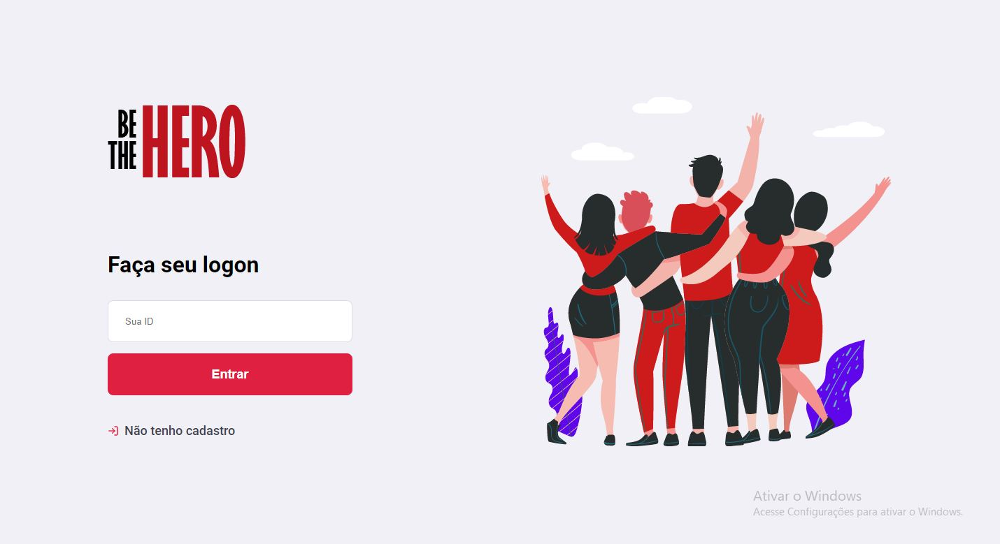

# SemanaOmnistack- Be The Hero

Projeto para estudo de desenvolvimento web e mobile, através do curso da Rocket Seat: Semana OmniStack. 

A ideia do projeto é criar uma a plataforma para ONGs cadastrarem casos específicos onde necessitam de uma ajuda financeira para uma boa causa, assim os usuário que se identificarem com alguma causa podem doar o valor pedido e assim salvar o dia e ser o héroi/heroína de alguma forma!

Ferramentas utilizadas:
VSCode,
JavaScript / Node.js,
REACT / REACT Native,
HTML,
CSS,
Nunjucks,
Git / GitHub,
Heroku,
SQlite3.

HOME

Aqui é possível as ONGs fazerem login para cadastrar novos casos, ou cadastrar uma nova ONG.

CADASTRO

Para adicionar uma ONG, basta inserir as informações nos campos requeridos.

CASOS

Essa é a visualização do casos cadastrados por ONG, a busca é feita através do ID de cada ONG, assim cada ONG tem o controle dos casos, podendo apagá-los assim que um herói/heroína ajudar.

